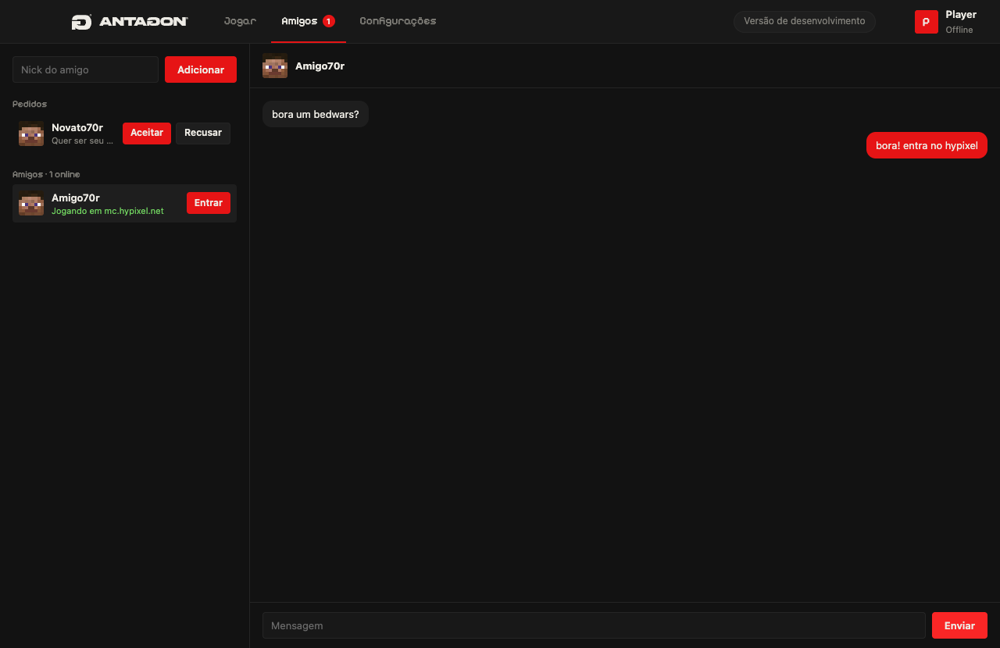

# Antagon Client

Client de Minecraft 1.8.9 para PvP, para macOS (Apple Silicon e Intel) e Windows. Um launcher em Electron instala e abre o jogo
com Forge, e um mod próprio adiciona HUD, mods de PvP e um menu no **Shift direito**, no estilo dos clients profissionais.


## Download

Baixe a versão mais recente em [Releases](https://github.com/voxesz/antagon-client/releases/latest):

- **macOS:** `Antagon-Client-macOS.zip`. Na primeira vez, clique com o botão direito no app → **Abrir**. Se o macOS disser
  que o app está danificado, rode `xattr -cr "/Applications/Antagon Client.app"` no Terminal.
- **Windows:** `Antagon-Client-Windows.zip`. Extraia e abra `Antagon Client.exe`. Se o SmartScreen avisar, clique em
  **Mais informações → Executar assim mesmo**.

O app não é assinado por uma conta paga da Apple ou da Microsoft, por isso os avisos na primeira abertura.

A partir da versão 0.1.2, o launcher confere se há versão nova no GitHub ao abrir e mostra o botão **Atualizar**.

| Amigos e chat | Menu no jogo (Shift direito) |
| --- | --- |
|  |  |

| Editor de HUD |
| --- |
|  |

## Recursos

**Launcher**

- Conta Microsoft original ou nick offline
- Instala Minecraft 1.8.9 + Forge numa pasta isolada, sem mexer no Minecraft ou no Lunar já instalados
- Roda nativo em Apple Silicon (Java 8 arm64 e natives do LWJGL arm64), com ~200 FPS
- Windows 10/11 x64 com Java 8 próprio, sem precisar instalar nada
- Plano de fundo animado em shader, com profundidade real capturada do jogo, ou uma imagem sua
- Instalação guiada do OptiFine
- Amigos: adicionar pelo nick, ver o que cada um está jogando, entrar no mesmo servidor e conversar (conta Microsoft)
- Atualização automática pelas Releases do GitHub
- Discord Rich Presence integrado, com controle de privacidade do servidor
- Fundos animados suspensos fora da tela inicial e durante o jogo
- Loja de cosméticos com ANTAGOIN$: capas, Coroa Antagon em 3D e inventário associado à conta Microsoft (itens retirados
  da loja continuam no inventário de quem já tem)
- Tag Antagon no chat, logo ao lado do ping no tab (dourada para admins), e cosméticos visíveis para outros jogadores com
  o client e sessão de comunidade ativa

**Mods** (configuráveis pelo Shift direito). O botão Antagon no menu inicial abre as configurações do launcher. No Esc,
os atalhos acima de **Abrir para LAN** abrem Configurações, Amigos e Loja; administradores também veem Admin.

O menu usa categorias, rolagem suave e altura ajustada à janela. Cabeçalho e rodapé ficam fixos; use a roda do mouse,
as setas ou Page Up/Page Down para explorar a lista. As opções e o editor de HUD continuam acessíveis em qualquer tamanho de interface.

No Windows, a Rádio Antagon abre a playlist e controla o Spotify pelas teclas de mídia; volume e capa do álbum são
exclusivos do macOS.

| HUD | Combate | Utilidades |
| --- | --- | --- |
| FPS, CPS, Ping | Reach Display | Toggle Sprint |
| Keystrokes | Combo Counter | Perspective (freelook) |
| Coordenadas, Relógio | Hitbox | Chat (horário, empilhar, tamanho) |
| Rádio Antagon (Spotify) | Hit Color | No Titles |
| | Crosshair | No Hurt Cam |

Todos os módulos do HUD podem ser arrastados e redimensionados pelos quatro cantos no editor.

## Desenvolvimento

Requisitos: Node.js 22+ e JDK 17+ (só para compilar o mod). Os testes de interface e do jogo usam perfis isolados em `build/`, sem modificar seus mundos ou preferências.

```sh
npm install
npm run build:mod
npm start
```

| Comando | O que faz |
| --- | --- |
| `npm run install:game` | Baixa e instala Minecraft 1.8.9 + Forge sem abrir o launcher |
| `npm test` | Testes de estado, downloads, privacidade e protocolo do Discord |
| `npm run test:java` | Testes de reflexão e limites do menu em diferentes resoluções |
| `npm run test:discord` | Valida o Rich Presence com o Discord local aberto |
| `npm run test:ui` | Abre o launcher com Playwright e percorre a interface |
| `npm run test:game` | Abre o jogo, testa menu, editor e mods e salva screenshots |
| `npm run package:mac` | Compila o mod e gera o `.app` em `release/` |
| `npm run package:win` | Compila o mod e gera a versão Windows x64 em `release/` |
| `npm run format` | Formata o código (Prettier) |

`scripts/capture-wallpaper.cjs` renderiza um novo plano de fundo a partir do jogo:
`node scripts/capture-wallpaper.cjs seed,x,y,z,yaw,pitch,horário`.

## Discord

O Rich Presence usa o aplicativo Antagon Client (`1554534012670836746`) e se conecta ao Discord instalado no computador
por IPC local. Não solicita senha, token de usuário ou bot. Ative ou desative em **Configurações → Discord**.
O status distingue launcher, menu, singleplayer e partida; o nome do servidor só aparece quando **Compartilhar o servidor** está ativo.
A conexão é restabelecida se o Discord for aberto depois do launcher, e a presença é removida ao desativar ou fechar o client.

Implementação baseada no [protocolo RPC oficial](https://discord.com/developers/docs/topics/rpc).

## Comunidade

Amigos, status e chat usam o [Supabase](https://supabase.com) (`supabase/`). O login confirma a conta Microsoft na API
da Mojang (`supabase/functions/minecraft-auth`) antes de criar a sessão; as regras de acesso ficam no próprio banco
(`supabase/migrations`): só amigos veem o seu status, só dá para mandar mensagem para amigos e ninguém cria amizade em
nome de outro. A chave em `electron/community.cjs` é a chave pública do projeto.

## Loja e pagamentos

A migração `supabase/migrations/20260930000000_cosmetics.sql` cria catálogo, carteira, inventário, equipamento e
as operações atômicas de compra. O cliente nunca grava saldo diretamente. O launcher envia ao banco apenas os UUIDs
da lista de jogadores; o jogo recebe um arquivo local com tags e capas, sem receber tokens da conta. A capa Antagon
equipada também assume a textura de capa do OptiFine durante a partida.

Para ativar pagamentos, aplique as migrações no projeto Supabase e publique as funções `coin-checkout` e `coin-webhook`.
Configure os segredos `STRIPE_SECRET_KEY`, `STRIPE_WEBHOOK_SECRET` e `CHECKOUT_RETURN_URL` (uma URL HTTPS de retorno após
o Checkout). Registre na Stripe um endpoint para `https://<project-ref>.supabase.co/functions/v1/coin-webhook` com os
eventos `checkout.session.completed` e `checkout.session.async_payment_succeeded`. A função do webhook tem
`verify_jwt = false` porque a Stripe não envia JWT do Supabase; ela valida a assinatura do corpo recebido. Os pacotes
custam R$ 4,90 (100 ANTAGOIN$), R$ 19,90 (550) e R$ 39,90 (1.200). As capas custam 100 ANTAGOIN$ e a coroa, 250.

O pagamento é concluído no navegador. Use **Atualizar saldo** na loja depois de voltar. A tag no chat é adicionada a
mensagens nos formatos `<Nick>` e `Nick:` (com prefixo opcional `[Rank]`); servidores com outros formatos podem não exibi-la. O tab usa a tag para
qualquer jogador autenticado com o client ativo. Contas offline não participam da loja nem publicam cosméticos.

A migração `20260930010000_admin.sql` concede o cargo de proprietário ao UUID verificado da conta **Voxesz** e cria o
painel **Admin**. O proprietário pode nomear ou remover outros administradores. Administradores podem buscar jogadores
registrados pelo nick, banir ou desbanir contas, definir o saldo de ANTAGOIN$ e conceder ou remover cosméticos. A aba **Criar capa** monta uma capa com
texto e imagem (face visível 5:8, textura final 1024 × 512 enviada ao bucket público `cosmetics`) e a coloca na loja,
envia para um jogador ou deixa só no inventário do admin; a aba **Itens** tira ou recoloca itens na loja. Todas as
mudanças ficam registradas em `admin_audit`; as permissões são verificadas no banco. O banimento bloqueia login,
comunidade, loja e jogo com a conta Microsoft no launcher distribuído. O modo offline e cópias modificadas do client
não podem ser bloqueados com segurança sem um servidor de jogo ou serviço de autorização obrigatório.

## Estrutura

```
electron/   processo principal: login, instalação, execução do jogo, comunidade e atualização
ui/         interface do launcher e shader do plano de fundo
mod-src/    mod Forge (HUD, menu, mods) e coremod (Hit Color e scoreboard)
supabase/   banco e função de login da comunidade
scripts/    build do mod, testes e captura do plano de fundo
assets/     fonte, ícones e natives arm64 (ver assets/natives-arm64/SOURCES.txt)
```

O mod não distribui código do Minecraft: acessa o jogo por reflexão com nomes SRG do Forge 1.8.9 e compila contra
um stub mínimo de `GuiScreen`.

## Licenças

- Código: [MIT](LICENSE)
- Pixelify Sans: SIL Open Font License ([assets/PixelifySans-LICENSE.txt](assets/PixelifySans-LICENSE.txt))
- Natives LWJGL/JInput arm64: BSD ([assets/natives-arm64/SOURCES.txt](assets/natives-arm64/SOURCES.txt))
- O Antagon Pack não faz parte do repositório. Coloque `Antagon Pack 8x.zip` em `assets/` para incluí-lo no build.

Projeto independente, não afiliado à Mojang ou à Microsoft. Minecraft é marca registrada da Mojang Synergies AB.
