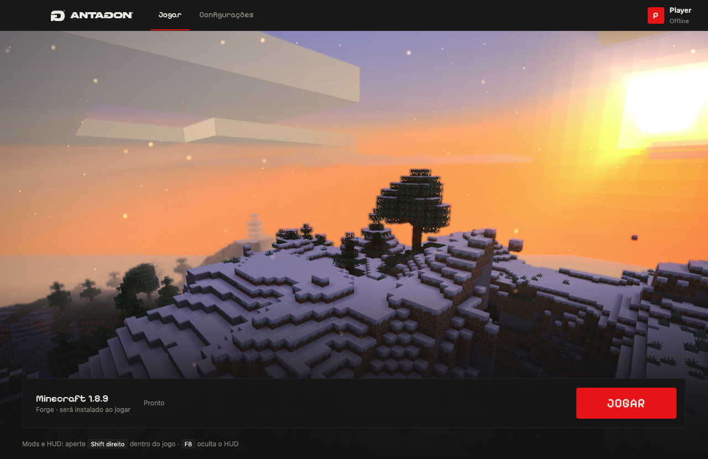
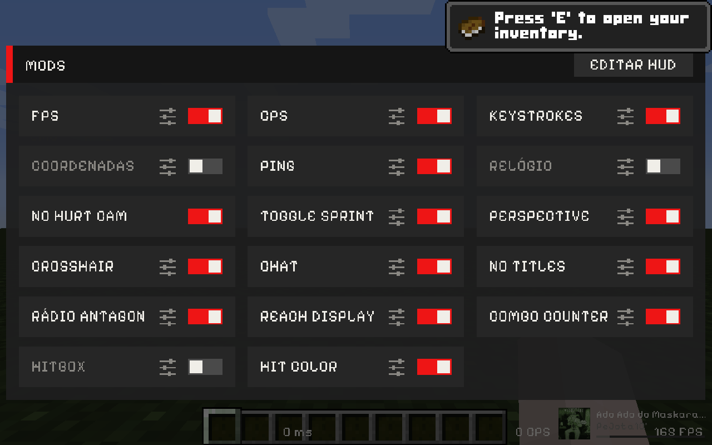
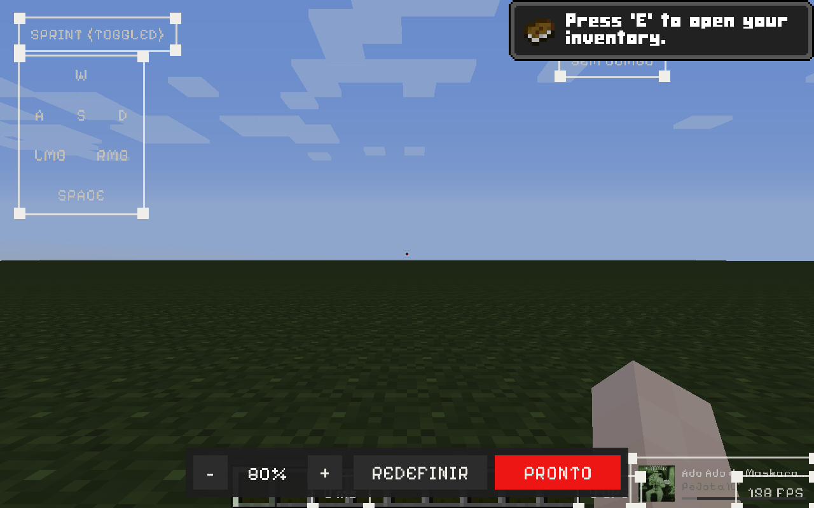

# Antagon Client

Client de Minecraft 1.8.9 para PvP, feito para macOS com Apple Silicon. Um launcher em Electron instala e abre o jogo
com Forge, e um mod próprio adiciona HUD, mods de PvP e um menu no **Shift direito**, no estilo dos clients profissionais.



| Menu no jogo (Shift direito) | Editor de HUD |
| --- | --- |
|  |  |

## Recursos

**Launcher**

- Conta Microsoft original ou nick offline
- Instala Minecraft 1.8.9 + Forge numa pasta isolada, sem mexer no Minecraft ou no Lunar já instalados
- Roda nativo em Apple Silicon (Java 8 arm64 e natives do LWJGL arm64), com ~200 FPS
- Plano de fundo animado em shader, com profundidade real capturada do jogo, ou uma imagem sua
- Instalação guiada do OptiFine

**Mods** (todos configuráveis pelo Shift direito)

| HUD | Combate | Utilidades |
| --- | --- | --- |
| FPS, CPS, Ping | Reach Display | Toggle Sprint |
| Keystrokes | Combo Counter | Perspective (freelook) |
| Coordenadas, Relógio | Hitbox | Chat (horário, empilhar, tamanho) |
| Rádio Antagon (Spotify) | Hit Color | No Titles |
| | Crosshair | No Hurt Cam |

Todos os módulos do HUD podem ser arrastados e redimensionados pelos quatro cantos no editor.

## Desenvolvimento

Requisitos: macOS, Node.js 22+ e JDK 17 (só para compilar o mod).

```sh
npm install
npm run build:mod   # baixa as dependências do Forge e compila o mod em assets/
npm start           # abre o launcher
```

| Comando | O que faz |
| --- | --- |
| `npm run install:game` | Baixa e instala Minecraft 1.8.9 + Forge sem abrir o launcher |
| `npm test` | Testes do launcher |
| `npm run test:ui` | Abre o launcher com Playwright e percorre a interface |
| `npm run test:game` | Abre o jogo, testa menu, editor e mods e salva screenshots |
| `npm run package` | Compila o mod e gera o `.app` em `release/` |
| `npm run format` | Formata o código (Prettier) |

`scripts/capture-wallpaper.cjs` renderiza um novo plano de fundo a partir do jogo:
`node scripts/capture-wallpaper.cjs seed,x,y,z,yaw,pitch,horário`.

## Estrutura

```
electron/   processo principal: login, instalação e execução do jogo
ui/         interface do launcher e shader do plano de fundo
mod-src/    mod Forge (HUD, menu, mods) e coremod da Hit Color
scripts/    build do mod, testes e captura do plano de fundo
assets/     fonte, ícones e natives arm64 (ver assets/natives-arm64/SOURCES.txt)
```

O mod não distribui código do Minecraft: acessa o jogo por reflexão com nomes SRG do Forge 1.8.9 e compila contra
um stub mínimo de `GuiScreen`.

## Licenças

- Código: [MIT](LICENSE)
- Pixelify Sans: SIL Open Font License ([assets/PixelifySans-LICENSE.txt](assets/PixelifySans-LICENSE.txt))
- Natives LWJGL/JInput arm64: BSD ([assets/natives-arm64/SOURCES.txt](assets/natives-arm64/SOURCES.txt))
- O Antagon Pack não faz parte do repositório. Coloque `Antagon Pack 8x.zip` em `assets/` para incluí-lo no build.

Projeto independente, não afiliado à Mojang ou à Microsoft. Minecraft é marca registrada da Mojang Synergies AB.
